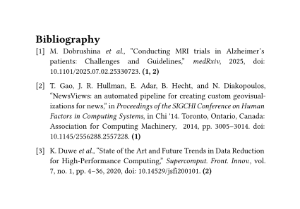

# `retrofit`

This package adds backreferences to each of your bibliography entries. More precisely, `retrofit` queries for all instances of a citation in your document, collects the page(s) it is on and formats them to your liking, while keeping them the `link` element to the location.

In order to correctly associate each formatted backreference to the bibliography entry, `retrofit` uses Typst's own internal bibliography handling through [hayagriva](https://github.com/typst/hayagriva) to ensure correct citation ordering.

## Getting Started

To add this package to your project, use this:

```typ
#import "@preview/retrofit": backrefs

// Default formatting wraps pages in parentheses and makes them bold.
// Change the formatting function with `backrefs.with(format: l => ...)` to your liking.
#show: backrefs

#bibliography("refs.bib")
```

<picture>
  <source media="(prefers-color-scheme: dark)" srcset="./ieee-dark.svg">
  
</picture>

## Usage

See the [manual]("docs/docs.pdf") for details.

## License

...
